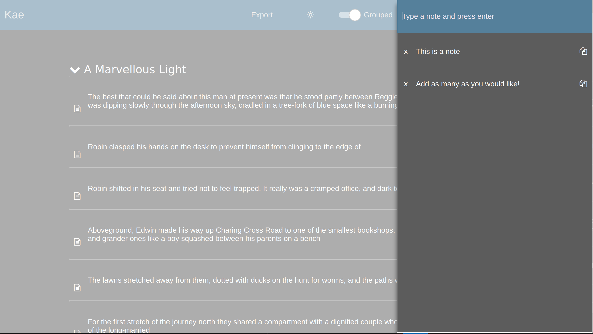

# Kae (Kobo Annotation Export)
A simple app designed to streamline extracting highlights from a Kobo e-reader and syncing them with a calibre instance. Future work may consider importing CSVs and building out syncing functionality. Check releases for prepackaged windows and linux builds.

## Features
- Detect Kobos that are plugged in, as well as ones that are plugged in while the app is running
- Automatically extract annotations, no more digging through hidden folders and copying SQLite databases
- Add notes to your annotations and color code them
- Search by text and title, sort by date, and filter by color tags
- Dark mode and light mode
- Title grouped view or flat view
- Export CSVs of your annotation for backup for use in other programs

## Build
Kae is a CMake/C++/Qt6.5.2 project with heavy QML utilization. [Check the docs](https://doc.qt.io/qt-6/gettingstarted.html) for info on how to download and install Qt. Dependencies are managed via vcpkg, using a manifest file. To build, run

`./vcpkg.sh && ./build.sh`

You may also consider building this inside of [docker containers](https://github.com/state-of-the-art/qt6-docker) to avoid the common hassles of environment management.